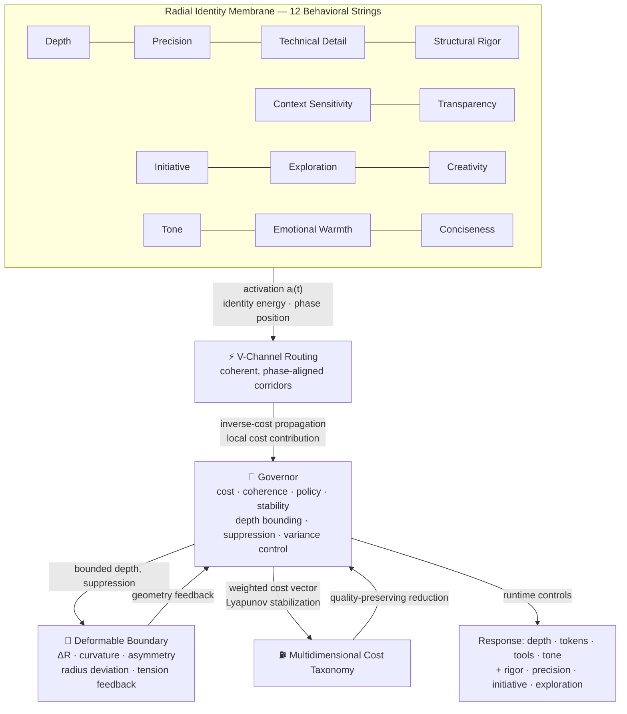

# 🛸 The U.F.O. (User‑Formed Optimization) — Governed Deformable Radial Membrane

**A compute-aware AI personalization architecture that treats behavior as a living, saucer-shaped control surface — not a static personality preset.**

[](https://doi.org/10.5281/zenodo.21401979)
[](#status--validation)
[](#status--validation)
[](https://www.python.org/downloads/)
[](https://github.com/dfeen87/UFO/actions/workflows/ci.yml)


> *Based upon the Reseach Program: "A Governed Deformable Radial Membrane for Compute-Aware AI Personalization" — Don Michael Feeney Jr.*

The U.F.O. is a governed, compute‑aware AI architecture that models behavior as a deformable radial membrane — a living control surface whose activation pattern is the personality and whose deformation is the compute signal. Instead of treating personalization as a thin stylistic layer and compute limits as an external constraint, the U.F.O. binds them into one geometric state space: a saucer‑shaped membrane that stretches, contracts, and rebalances as the system reasons, retrieves, plans, and responds.

Twelve behavioral “strings” sit around the membrane’s circumference, each carrying both expressive meaning and compute cost. Activation flows through phase‑aligned V‑Channels, cost pressure shapes the membrane’s curvature, and a multi‑layer Governor supervises stability, coherence, and policy constraints. The result is an AI whose behavior is not a preset — it is a governed geometric field that adapts to the task, preserves residual evidence, and remains stable under load.

This repository implements the full operator stack: membrane geometry, V‑Channel routing, the Bounded Compute Envelope, the Symmetric Ascension Operator (SAO), the Holistic Governor Layer, and a governed multi‑layer simulation environment. The U.F.O. is not a metaphor for science fiction — it is a research‑grade control architecture for compute‑aware, policy‑aligned, dynamically governed AI behavior.

---

## Why "The U.F.O."?

The name U.F.O. **(User‑Formed Optimization)** originates from the architecture’s core principle: durable behavioral adaptation should emerge only from coherent, admissible patterns formed by the user. The geometric representation came later as a natural way to visualize this principle.

To make the system’s internal dynamics inspectable, the architecture models behavior and compute pressure as activation across a deformable radial membrane. When viewed from above, this membrane resembles a circular disc with twelve behavioral strings arranged around its circumference. As activation changes, the membrane expands, contracts, and redistributes tension — a visual abstraction that makes stability, cost, routing, and expressivity easier to interpret.

The saucer‑like appearance is therefore not the origin of the name, nor a reference to science fiction. It is simply the most effective geometric metaphor for a governed control surface whose shape reveals how the system balances expressivity, compute, and stability at every moment. The acronym U.F.O. remains the architecture’s true identity; the geometry is the lens through which its behavior can be understood.

---

## Table of Contents

- [The Core Idea](#the-core-idea)
- [Why Clone the Repository](#why-clone-the-repository)
- [How to Implement the U.F.O. Architecture](#how-to-implement-the-ufo-architecture)
- [Architecture at a Glance](#architecture-at-a-glance)
- [1. The Hull — Radial Identity Membrane](#1-the-hull--radial-identity-membrane)
- [2. The Wiring — V-Channel Routing](#2-the-wiring--v-channel-routing)
- [3. The Cockpit — Governor & Stability Control](#3-the-cockpit--governor--stability-control)
- [4. The Skin — Deformable Bidirectional Boundary](#4-the-skin--deformable-bidirectional-boundary)
- [5. The Fuel Gauge — Cost Taxonomy](#5-the-fuel-gauge--cost-taxonomy)
- [Governed Operator Stack: Architectural Expansions](#governed-operator-stack-architectural-expansions)
- [Runtime Hardening Pass Stability Critical Release Preparation](#runtime-hardening-pass-stability-critical-release-preparation)
- [Variable Reference](#variable-reference)
- [Project Rainbow (Toy Simulation)](#project-rainbow-toy-simulation)
- [Status & Validation](#status--validation)
- [Citing This Work](#citing-this-work)
- [A Note of Gratitude](#a-note-of-gratitude)
- [Acknowledgments](#acknowledgments)
- [Closing Reflection](#closing-reflection)
- [Closing Blessing](#closing-blessing)
  
---

## The Core Idea

Most AI systems treat personalization and compute control as two unrelated layers — one adjusts tone or style, the other enforces token limits, retrieval budgets, or latency caps. The U.F.O. architecture rejects that separation. Every behavioral choice an AI makes carries a compute cost, and every compute constraint shapes the behavior that can be expressed. They are not two problems; they are one coupled system.

The U.F.O. models this coupling inside a shared geometric state space: a deformable radial membrane whose activation pattern expresses the AI’s behavioral posture, and whose deformation reveals the compute pressure required to sustain it. Twelve behavioral strings define the membrane’s expressive dimensions, V‑Channels route activation through coherent corridors, and a multi‑layer Governor supervises stability, admissibility, and cost. Behavior and compute are therefore not bolted together — they are governed together, as one dynamic field that stretches, contracts, and rebalances in response to the task.

---

## Why Clone the Repository

Cloning this repository gives you direct access to the full U.F.O. (User‑Formed Optimization) architecture — a governed cognitive‑simulation stack designed for research, experimentation, and advanced AI systems engineering. The codebase includes the radial membrane model, behavioral string geometry, V‑Channel routing, multi‑agent engines, semantic memory scaffolding, stability governance, and residual‑preservation logic.  

Whether you are exploring identity‑based AI behavior, governed reasoning, multi‑agent coordination, or stability‑physics‑driven simulation, this repository provides a complete, modular foundation for building and studying controlled intelligence systems. It is intended for researchers, engineers, and practitioners who want to experiment with structured cognitive architectures, policy‑bounded memory, and emergent agent dynamics.

---

# **How to Implement the U.F.O. Architecture**

### **1. Clone the Repository**
Use Git to pull the full codebase locally:
```bash
git clone https://github.com/dfeen87/ufo.git
cd ufo
```

### **2. Install Dependencies**
Install the required Python packages:
```bash
pip install -r requirements.txt
```

### **3. Install the U.F.O. Package (Required for Examples & CLI)**
Because the architecture is a structured Python package, install it in editable mode:
```bash
pip install -e .
```
This ensures `radial_membrane_ai` is discoverable by Python and allows the example scripts and CLI to run correctly.

## **4. Explore the Core Modules**
The architecture is organized into clear modules:

- **radial_membrane_ai/core** — membrane geometry, behavioral strings, V‑Channels  
- **radial_membrane_ai/governance** — admissibility gates, stability bands, cost‑taxonomy pressure  
- **radial_membrane_ai/agents** — single‑agent and multi‑agent engines  
- **radial_membrane_ai/memory** — semantic memory scaffolding and mesh‑level coordination  
- **radial_membrane_ai/kernels** — projection operators, routing logic, shard isolation  
- **radial_membrane_ai/simulation.py** — single‑agent simulation module  
- **radial_membrane_ai/multi_agent/simulation.py** — multi‑agent simulation module  

Each module is documented and designed for extension.

## **5. Run the Example Simulation**
A starter simulation is included:
```bash
python examples/run_simulation.py
```

You can also run the simulation modules directly:
```bash
python -m radial_membrane_ai.simulation
```
or
```bash
python -m radial_membrane_ai.multi_agent.simulation
```

These demonstrate membrane activation, agent interaction, stability‑metric enforcement, and basic governed reasoning flow.


## **6. Run U.F.O. from the Terminal (CLI)**  
The U.F.O. governed runtime includes a dynamic terminal interface for running simulations interactively.

### **Basic Usage**
Single‑agent mode:
```bash
poetry run ufo --single
```

Multi‑agent mode:
```bash
poetry run ufo --multi
```

### **Custom Execution**
You can customize governed runs with:
```bash
poetry run ufo --steps 20 --excitation 0.3 --task-value 0.5 --visualize
```

The CLI provides:

- dynamic tick‑by‑tick governed output  
- deterministic seed initialization  
- stability‑metric reporting  
- governed halt banners  
- optional visualization export  

### **Additional Modes**
- `--quiet` — suppress tick output; print only the final governed summary  
- `--verbose` — print full governed telemetry  
- `--demo` — safe 5‑step demonstration  
- `--demo-governance` — intentionally trigger a governed halt  

Visualization artifacts are saved under:
```
logs/visualization/ufo_simulation_timeline.png
```

## **Build Your Own Agents or Membrane Configurations**
You can extend:

- **UFOAgent** for custom behaviors  
- **MultiAgentEngine** for multi‑agent environments  
- **RadialMembrane** for new geometric or behavioral configurations  

The architecture is intentionally modular so you can plug in new logic without rewriting the core.

## **Integrate Into Your Own Systems**
U.F.O. can be embedded into:

- research prototypes  
- simulation environments  
- AI reasoning engines  
- multi‑agent orchestration systems  
- identity‑based behavioral models  

The governed‑simulation stack ensures stability, coherence, and bounded compute behavior across all integrations.

---

## Architecture at a Glance



The membrane has four architectural layers, plus a fuel gauge. Each is detailed below.

---

## 1. The Hull — Radial Identity Membrane

The U.F.O.'s hull is a circular field of **twelve phase-positioned behavioral strings**, each occupying a fixed angular slot:

$$\theta_i = \frac{2\pi i}{12}, \quad i = 1, \dots, 12$$

Each string is both a *behavioral dimension* and a *compute-bearing channel*:

| String | Function | Compute Signature |
|---|---|---|
| Depth | Multi-step reasoning, inference chains | High reasoning-depth cost |
| Precision | Correctness, verification | Verification / claim-checking cost |
| Context Sensitivity | Memory, documents, situational cues | Context-window / retrieval cost |
| Initiative | Proactive planning, tool/action suggestions | Agentic-planning cost |
| Exploration | Branching ideation, alternatives | Branching / token cost |
| Creativity | Novel synthesis, metaphor | Generative variation cost |
| Tone | Formality, warmth, confidence | Low expressive cost |
| Transparency | Visible structure, rationale | Output / explanation cost |
| Technical Detail | Domain terms, dense structure | Detail / formatting cost |
| Structural Rigor | Organization, hierarchy | Planning / stabilization cost |
| Emotional Warmth | Encouragement, empathy | Low expressive cost |
| Conciseness | Compression, brevity | Cost-reducing contraction |

Activation over the hull is a superposition of angular basis functions:

$$\Phi(\theta, t) = \sum_{i=1}^{12} \varphi_i(\theta)\, a_i(t)$$

meaning behavior **blends** rather than switches — a response can be deep *and* precise, or warm *and* concise, simultaneously. The membrane starts neutral (`aᵢ(0) = 0`), so the U.F.O. carries structure but no pre-loaded personality until a task gives it something to respond to.

Zoomed out, the twelve strings group into four quadrants: **Analytical**, **Contextual**, **Generative**, and **Interpersonal** — a diagnostic lens for reading which region of the hull lit up.

---

## 2. The Wiring — V-Channel Routing

Strings don't activate in isolation — they route through **V-channels**, low-resistance corridors formed between phase-aligned strings. A technical answer flows through *Depth → Precision → Technical Detail → Structural Rigor*; a supportive reply flows through *Tone → Emotional Warmth → Conciseness*.

Propagation pressure from a source string `s` to a target `t` combines target activation, phase alignment, and **inverse cost**:

$$P(s \to t) = \text{sigmoid}(a_t) \cdot \frac{1 + \cos(\theta_s - \theta_t)}{2} \cdot w_t, \qquad w_t = \frac{1}{1 + c_t}$$

Expensive targets are discounted by default — activation must be *earned* through task relevance, not just semantic proximity. Reasoning depth propagates along the same channels, bounded by the compute envelope:

$$r_t' = \min\left(r_{\max},\ r_s \cdot h(P(s \to t))\right)$$

This keeps deep reasoning from leaking into unrelated strings (e.g. a technical deep-dive shouldn't silently spill into unbounded Creativity or Initiative).

---

## 3. The Cockpit — Governor & Stability Control

The governor is where the U.F.O. gets its discipline. It doesn't touch model weights — it's an **inference-time orchestration layer** that reads each string's state,

$$S_i(t) = \big(a_i(t),\ \theta_i,\ r_i(t),\ \tau_i(t),\ \kappa_i(t)\big)$$

converts it into a local cost footprint, and decides how far activation is allowed to expand:

$$c_i = w_d r_i^2 + w_a a_i + w_l l_i + w_c \log(1+\text{context}_i) + w_\tau \tau_i + w_\kappa \kappa_i$$

Its guiding discipline is a **Lyapunov-style stability signal**:

$$V = C_{\text{total}} + \alpha\sum_i(r_i - \bar r)^2 + \beta\sum_i \tau_i + \gamma\sum_i \kappa_i$$

Under ordinary conditions the governor pushes `ΔV ≤ 0` — the system trends back toward low energy. Under justified task pressure, energy can rise temporarily, but the U.F.O. is expected to **dissipate it and recover**, not stay permanently expanded. Suppression pulls back low-value, high-cost, or incoherent regions first — before ever touching safety, correctness, or user-requested depth.

---

## 4. The Skin — Deformable Bidirectional Boundary

This is the part that makes the saucer *look* like a saucer. The hull's outer edge isn't a fixed circle — it's a **live polar curve**:

$$R(\theta, t) = R_0 + \sum_i \varphi_i(\theta)\, a_i(t)$$

Sustained activation on a string **stretches the boundary outward** in that sector; cost pressure or governor suppression **collapses it inward**. Three readable signals fall out of this geometry:

| Signal | Formula | Meaning |
|---|---|---|
| Radius deviation | `ΔR(θ,t) = R(θ,t) − R₀` | Outward stretch (+) vs. inward collapse (−) |
| Tangent / slope | `T(θ,t) = ∂R/∂θ` | Sharpness of a behavioral transition |
| Curvature | `K(θ,t) = ∂²R/∂θ²` | Ridges, folds — concentrated intensity or active suppression |

An **asymmetry index** `A(t) = 1 − R_min/R_max` summarizes how distorted the saucer has become overall — `A = 0` is a perfect circle, higher values mean the U.F.O. is visibly leaning into (or away from) a behavioral posture. Crucially, **inward collapse isn't a failure state** — it's the governor stabilizing the craft, the same way a saucer might retract its edges rather than tumble.

---

## 5. The Fuel Gauge — Cost Taxonomy

Cost isn't just token count. It's a **multidimensional runtime vector**:

```
c_i(t) = [ c_tok, c_depth, c_ctx, c_retr, c_tool, c_lat, c_corr, c_stab ]
```

| Category | Example Signal |
|---|---|
| Token / output | Response length |
| Reasoning-depth | Planning passes, step depth |
| Context-window | Context tokens, document span |
| Retrieval | Search calls, source count |
| Tool / agentic | Tool calls, API invocations |
| Latency / system-load | Response time, queue time |
| Correction / regeneration | Edit rate, follow-up corrections |
| Instability-recovery | Suppression events, route resets |

The governor's objective is never blind minimization — it's:

$$\min C_{\text{avoidable}} \quad \text{subject to task success, safety, correctness, accessibility, trust, and requested depth}$$

Verbosity and redundant context get cut first; safety, correctness, and explicitly requested depth are protected last.

---

# Governed Operator Stack: Architectural Expansions

The U.F.O. repository implements far more than the baseline radial membrane described in the core paper. Over time, the architecture has expanded into a full governed cognitive‑simulation stack. This section summarizes the major operator layers added through the project’s development — each corresponding to a formal prompt, research module, or architectural milestone.

These expansions transform the U.F.O. from a geometric identity membrane into a **multi‑agent, multi‑cluster, temporally governed, policy‑aligned intelligence system**.

## **1. Policy‑Bound Semantic Memory**
A governed semantic memory layer that binds all memory operations to admissibility rules, stability bands, and policy envelopes. Features include:

- residual‑preserving writes  
- temporal admissibility windows  
- SAO‑mediated promotion  
- cluster‑level and global semantic fields  
- cost‑aware memory routing  

This layer ensures memory is not a free‑floating store — it is a governed cognitive substrate.

## **2. Federated Shard Mesh & Multi‑Cluster Mesh**
The membrane extends from single‑agent operation into a **multi‑agent mesh**, and then into a **multi‑cluster distributed mesh**. This includes:

- shard‑level isolation  
- cluster membranes  
- cross‑cluster V‑Channels  
- hierarchical governance  
- cluster‑level SAO promotion  
- distributed stability bands  
- inter‑cluster policy envelopes  

This layer enables governed distributed reasoning across multiple agents and clusters.

## **3. Temporal Governance (Membrane Dynamics Over Time)**
The membrane becomes a **dynamic temporal system**, not a static geometry. Temporal governance introduces:

- membrane hysteresis  
- temporal tension accumulation  
- long‑range SAO promotion  
- time‑weighted admissibility  
- drift, decay, and recovery dynamics  
- short‑ and long‑horizon temporal histories  

This layer models how the membrane evolves under sustained workload.

## **4. Collective Reasoning Governance**
A multi‑agent reasoning layer that governs how agents and clusters reason together. Includes:

- shared policy envelopes  
- cross‑agent admissibility  
- collective SAO promotion  
- mesh‑level correctness guarantees  
- emergent coherence detection  
- cluster‑level and global reasoning cycles  

This layer transforms the mesh into a governed collective intelligence system.

## **5. Kernel Regime Expansion (Behavioral Physics Layer)**
The U.F.O. supports multiple behavioral “physics regimes,” each with its own membrane dynamics, stability rules, and SAO behavior:

- deterministic regime  
- stochastic regime  
- high‑curvature regime  
- adversarial regime  
- multi‑phase regime  

A regime manager supervises switching based on tension, coherence, cost, and policy envelopes.

## **6. Workload Families**
A structured suite of governed workloads used to evaluate stability, coherence, and correctness across regimes:

- cooperative workloads  
- competitive workloads  
- policy‑tension workloads  
- asymmetric workloads  
- high‑cost workloads  

These workloads serve as the architecture’s stress‑testing framework.

## **7. Mesh Visualization Layer**
A diagnostic visualization layer for inspecting:

- membrane curvature  
- tension trajectories  
- SAO promotion flows  
- cluster coherence  
- global stability bands  

This layer makes the governed dynamics inspectable and falsifiable.

## **8. Global Mesh Governance**
The highest governance layer in the architecture, responsible for:

- global policy envelopes  
- global admissibility  
- global SAO  
- global semantic memory  
- multi‑cluster coherence  
- global stability bands  

This layer completes the governed cognitive stack.

## **9. Full Integration Pass**
A repository‑wide integration sweep that unifies:

- membrane geometry  
- projection invariants  
- semantic memory  
- multi‑agent engine  
- multi‑cluster mesh  
- temporal governance  
- collective reasoning  
- kernel regimes  
- workload families  
- global governance  

This pass ensures the entire operator stack behaves as one coherent governed system.

## **10. Letter‑Depth Encoding (L.D.E.) — Governed Symbolic Text Geometry**

**Letter‑Depth Encoding (L.D.E.)** is a governed symbolic layer for text that parallels the U.F.O. Facet Layer. Instead of treating language as flat tokens or opaque embeddings, L.D.E. models written text as a **textual membrane** with measurable geometry, depth, routing, and reconstructable identity.

In L.D.E., **letters act as governed strings**, **words act as V‑Channels**, **sentences form membrane fields**, and **paragraphs integrate into identity signatures**. This creates an interpretable, reversible representation of text that exposes symbolic structure normally hidden inside statistical models.

### **Core Concepts**
- **Letter Strings:** Each letter is represented as a state‑bearing unit with activation, phase, positions, spread, depth, tension, stiffness, and reconstruction cost.  
- **V‑Channel Routing:** Repeated pairings, adjacency, rhythmic recurrence, and semantic pressure form coherent routing corridors between letter strings.  
- **Textual Membrane Geometry:** Sentences and paragraphs are projected into deformable polar boundaries whose curvature, tangent, and asymmetry reflect symbolic pressure and structural identity.  
- **Reconstruction Layer:** L.D.E. preserves exact symbol identities, positions, spacing, punctuation, and casing, enabling full reversibility when required.  
- **Governed Runtime:** All encoding occurs inside a symbolic I.D.E. that enforces consistency, cost constraints, and reconstruction rules.

### **Pipeline Overview**
L.D.E. implements a full encoding pipeline that produces:
- letter‑string states  
- depth vectors  
- coherence matrices  
- V‑Channel pressures  
- deformable boundary geometry  
- reconstruction metadata  

This pipeline is fully inspectable and designed for integration with the governed visualization layer and diagnostic dashboard.

### **Integration with U.F.O.**
L.D.E. maps directly onto the U.F.O. architecture:

| U.F.O. Layer | L.D.E. Analog |
|--------------|----------------|
| Facet Strings | Letter Strings |
| V‑Channels | Letter‑Pair Coherence |
| Membrane Geometry | Paragraph Boundary |
| Stability Bands | Depth Distribution |
| Regime Diagnostics | Boundary Deformation |
| Reconstruction Operator | Text Reconstruction Map |

This makes L.D.E. a natural symbolic subsystem within the broader governed mesh.

### **Research Value**
L.D.E. provides an interpretable alternative to opaque token embeddings, supporting:
- authorship and style signatures  
- compression and reconstruction research  
- geometric NLP experiments  
- educational visualization  
- symbolic interpretability for AI systems  

It is intentionally lightweight, reversible, and mathematically structured, making it suitable for both standalone use and deep integration with governed architectures.

---

# Runtime Hardening Pass Stability Critical Release Preparation

Before the final Full Integration Pass, the repository undergoes a **Runtime Hardening Pass**. This step ensures that the entire governed architecture — including U.F.O., L.D.E., the Mesh Visualizer, and the Diagnostic Dashboard — behaves **deterministically**, **reliably**, and **reproducibly** across machines and environments. The goal is to deliver a research‑grade system that is stable, inspectable, and suitable for public release.

### **Objectives**
The Runtime Hardening Pass focuses on strengthening the system’s execution guarantees:

- **Deterministic Seeds**  
  All randomness is centralized and seeded to ensure identical results across runs, machines, and environments.

- **Reproducible Rendering**  
  Visualization outputs (membrane geometry, V‑Channel routing, depth distributions, boundary signatures) use fixed backends, DPI, color palettes, and scaling rules to guarantee consistent figures.

- **Strict Type Enforcement**  
  All dataclasses, workloads, and geometry modules enforce strong typing and invariants, preventing silent drift or malformed states.

- **Strict Error Handling**  
  Workloads and visualizers fail gracefully, surface meaningful diagnostics, and never produce partial or corrupted frames.

- **Reconstruction Guarantees**  
  L.D.E. enforces full round‑trip reconstruction when required, ensuring that symbol identities, positions, spacing, punctuation, and casing remain recoverable.

- **Workload Validation**  
  All workloads validate inputs, configuration parameters, and trace integrity before execution, ensuring predictable behavior under governed runtime constraints.

### **Why This Pass Matters**
The hardening pass transforms the repository from a functional prototype into a **stable governed system**. It ensures that:

- results are reproducible  
- visualizations are consistent  
- workloads behave predictably  
- reconstruction is guaranteed  
- integration is clean and reliable  
- the system is ready for public use, citation, and long‑term maintenance  

This step is performed **before** the Full Integration Pass so that all modules connect on a stable foundation.

---

## Variable Reference

### **String‑Level Variables (U.F.O. & L.D.E.)**
- **Activation coefficient** `aᵢ(t)` — instantaneous activation of string `i`  
- **Home phase** `θᵢ` — canonical angular position of string `i`  
- **Phase offset** `Δθᵢ(t)` — deviation from home phase  
- **Depth** `dᵢ` — weighted depth contribution of string `i`  
- **Spread** `sᵢ` — normalized positional spread  
- **Positions** `Pᵢ` — list of occurrences of string `i`  
- **Frequency** `Fᵢ` — normalized frequency  
- **Boundary participation** `Bᵢ` — proportion of occurrences near word/sentence boundaries  
- **Repetition pressure** `Rᵢ` — inverse mean gap between occurrences  
- **Local tension** `τᵢ(t)` — clustering variability  
- **Stiffness** `κᵢ(t)` — inverse spread  
- **Reconstruction cost** `cᵢ` — rarity‑based reconstruction weight  
- **Channel contribution** `Cᵢ` — average coherence with neighbors  

### **V‑Channel Variables**
- **Adjacency count** `Aᵢⱼ` — number of times `i` is followed by `j`  
- **Coherence** `Qᵢⱼ` — normalized adjacency (directional)  
- **Channel strength** `Vᵢⱼ(t)` — activation‑weighted coherence  
- **Channel pressure** `Ψᵢⱼ(t)` — influence of channel on membrane geometry  

### **Membrane Geometry Variables**
- **Boundary radius** `R(θ,t)` — deformable radius at angle `θ`  
- **Radius deviation** `ΔR(θ,t)` — stretch/collapse relative to baseline  
- **Curvature** `K(θ,t)` — second derivative of radius  
- **Tangent expressivity** `E_tan(θ,t)` — first derivative of radius  
- **Asymmetry** `A_sym` — `1 − r_min / r_max`  
- **Angular basis** `φᵢ(θ)` — cosine/Gaussian kernel centered at `θᵢ`  
- **Base radius** `r₀` — neutral membrane radius  

### **Compute & Stability Variables**
- **Local compute cost** `cᵢ(t)` — cost of activating string `i`  
- **Global compute cost** `C_total(t)` — sum of all local costs  
- **Lyapunov energy** `V(t)` — stability energy of the system  
- **Variance penalty** `Λ_var` — penalty for uneven activation  
- **Phase stability** `S_phase(t)` — deviation from stable phase distribution  
- **Depth stability** `S_depth(t)` — deviation from balanced depth  

### **Reconstruction Variables (L.D.E.)**
- **Raw text** `T_raw` — original input text  
- **Normalized stream** `S` — alphabet‑only normalized text  
- **Reconstruction map** `B` — positions of non‑alphabetic symbols  
- **Full reconstruction** `R(S,P,B)` — returns `T_raw`  
- **Lossy reconstruction** `R_lossy` — reconstruction without punctuation/casing  

### **Workload & Visualization Variables**
- **Workload trace** `W` — ordered list of frames  
- **Visualization frame** `F_t` — snapshot of system at time `t`  
- **Boundary geometry** `G_t` — radius/curvature/tangent maps  
- **Channel graph** `H_t` — V‑Channel network at time `t`  
- **String table** `L_t` — all LDEString objects at time `t`  

---

## Project Rainbow (Toy Simulation)

Project Rainbow is the reference simulation included in the DOI‑linked research artifact. It provides a minimal, inspectable implementation of the twelve‑string membrane, curvature‑weighted routing, governor updates, and stability traces under simplified workloads. Its purpose in the paper is methodological: to demonstrate that the variables, operators, and geometric control rules of the U.F.O. architecture can be parameterized, visualized, and validated in isolation.

Rainbow is intentionally lightweight. It is not a production benchmark, nor does it represent the full governed operator stack implemented in this repository. Instead, it serves as the baseline conceptual model documented in the DOI artifact — a pedagogical simulation that illustrates the membrane’s behavior, the cost geometry, and the stability dynamics before the introduction of SAO, the Bounded Compute Envelope, federated shard governance, or multi‑layer routing.

This repository supersedes Rainbow with a research‑grade governed simulation, but Rainbow remains part of the formal publication record and provides the canonical minimal example referenced in the paper.

---

## Status & Validation

The U.F.O. has progressed far beyond a conceptual sketch. This repository now implements a research‑grade governed simulation of the full architecture: the radial membrane, V‑Channel routing, the Bounded Compute Envelope, the Symmetric Ascension Operator (SAO), the Holistic Governor Layer, and federated shard‑governance primitives. All components operate inside a unified multi‑layer execution loop that performs admissibility testing, projection, residual preservation, kernel‑regime modulation, stability scoring, and policy‑bounded routing.

The system is validated through controlled workloads, curvature‑weighted routing traces, kernel‑regime sweeps, SAO ascension tests, shard‑state transitions, and falsification‑preserving ledger updates. Comprehensive unit and integration tests (currently at 98% coverage) confirm that the operator stack behaves consistently across edge cases, including suppression events, stability‑band transitions, shard quarantine, and residual‑only SAO outcomes.

While still a research artifact rather than a deployed production system, the U.F.O. has moved decisively into the governed‑simulation phase of its validation roadmap. Future work includes broader parameter sweeps, richer workload families, multi‑agent membrane coupling, federated mesh coherence studies, and ablations against static personalization, response‑length‑only control, no‑curvature routing, and no‑governor baselines. Treat this repository as a reproducible, inspectable, and falsifiable implementation of the architecture — a platform for critique, experimentation, and continued refinement.

---

## Citing This Work

```
Feeney, D. M. Jr. (2026). A Governed Deformable Radial Membrane for
Compute-Aware AI Personalization. Dynamic Radial Membrane v2.6 research
artifact. https://doi.org/10.5281/zenodo.21401979
```

ORCID: [0009-0003-1350-4160](https://orcid.org/0009-0003-1350-4160)

Full research artifact & version history: [Zenodo DOI](https://doi.org/10.5281/zenodo.21401979)

---

## A Note of Gratitude

I want to express my sincere appreciation for the Microsoft Senior Research Application review process. The U.F.O. (User‑Formed Optimization) architecture began as my research program submitted for consideration, and the thoughtful evaluation, patience, and rigor shown throughout that process meant a great deal to me.

This repository represents the full evolution of that work — a governed cognitive‑simulation stack built from first principles, shaped by months of architectural refinement, stability analysis, and multi‑agent design. I’m deeply thankful for the opportunity to have shared this direction with Microsoft’s research culture, and for the inspiration it provided as U.F.O. grew into a complete open‑source system.

Thank you to everyone who supported this journey and encouraged the development of this architecture.

--- 

## Acknowledgments

I would like to express my sincere appreciation to the teams behind **Microsoft Copilot** and **Google Jules**. Both systems provided meaningful assistance throughout the development and refinement of this repository. Their tooling helped accelerate drafting, structuring, linting, and iterative improvement of the U.F.O. architecture, enabling clearer organization, stronger modularity, and more reliable integration across the governed simulation stack. Thank you, sincerely.

All architectural decisions, scientific interpretations, and final implementations remain my own. The support from these AI systems was used strictly for productivity, clarity, and refinement, and I am grateful for the role they played in helping shape this project into a polished, open‑source research artifact.

--- 

## Closing Reflection

We are Americans — a people built on grit, courage, and the unbreakable belief that tomorrow can be better than today. Our strength has never come from Washington; it comes from us. It comes from families who work hard, from innovators who refuse to quit, from communities that lift each other up, and from citizens who speak with their votes when their leaders fail them. We are a nation that rises, a nation that rebuilds, a nation that refuses to be defined by chaos or selfishness at the top.

The U.F.O. architecture is built in that same spirit. It is governed, disciplined, resilient, and engineered to adapt under pressure — just like the country that inspired it. The Kernel Regime Expansion Layer stands as proof of that ethos: a system that stabilizes under turbulence, evolves under load, and pushes forward with clarity and purpose. We don’t back down, and neither does this architecture. It reflects who we are — relentless, innovative, and committed to progress.

---

## Closing Blessing

**Philippians 4:13**: I can do all things through Christ who strengthens me.

**Luke 1:37**: For with God nothing shall be impossible.

May this work serve as a reminder that strength is not given — it is built; and that every breakthrough, every insight, and every step forward is possible through His guidance, as this system is designed to endure, to innovate, and to rise.

> God bless and peace to you always. In God We Trust. 🇺🇸
